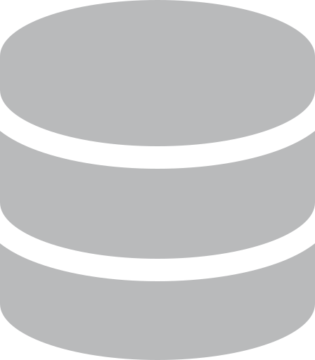

<p align="center">
 <a href="https://discord.com/users/519937775651258379">
     
 </a>
 <a href="https://discord.io/gophers-latam">
     
 </a>
<hr style="height:2px;border-width:0;color:gray;background-color:gray">  
</p>

<p align="center">
  :shipit: &nbsp;&nbsp;
  
</p>

```go
👀 I'm a simple coder that like Golang and do stuffs on web.
🌐 Media: https://zeroidentidad.wordpress.com
```

<hr style="height:3px;border-width:0;color:gray;background-color:gray">

<p align="center">
<span>&nbsp;☑️ <b>Working with:</b>&nbsp;&nbsp;</span>
<a href="https://go.dev" target="_blank">  </a>
<a href="https://developer.mozilla.org/docs/JavaScript" target="_blank">  </a>
<a href="https://w3schools.com/sql" target="_blank">  </a>
<a href="https://cloud.google.com" target="_blank">  </a>
<span>&nbsp;&nbsp;&nbsp;☑️ <b>Learning:</b>&nbsp;&nbsp;</span>
<a href="https://docs.aurelia.io" target="_blank">  </a>
 <a href="https://go.dev" target="_blank">  </a>
</p>

<hr style="height:1px;border-width:0;color:gray;background-color:gray">

- ```Some stuff's list of current work and learning path``` [🗒️**Gists**](https://gist.github.com/zeroidentidad) | [⭐️**Stars**](https://github.com/zeroidentidad?tab=stars) | [🛡️ **g.dev**](https://g.dev/zeroidentidad)

- [🧡 [Wattpad] **Zero Golang Notes**...](https://www.wattpad.com/story/338549436-zero-golang-notes)
- [💙 [Posts] **gophers-latam.github.io**...](https://gophers-latam.github.io/posts)

<hr style="height:1px;border-width:0;color:gray;background-color:gray">

🔐 **commits' verified signature** GPG key ```🆔 72274B90985C9107 ```

<!--


<p align="center">
  
    
</p>
-->
