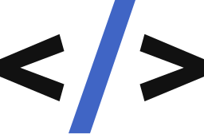

<p align="center">
 <a href="https://discord.com/users/519937775651258379">
     
 </a>
 <a href="https://discord.gg/AEarh2kSvn">
     
 </a>
<hr style="height:2px;border-width:0;color:gray;background-color:gray">  
</p>

<p align="center">
  :shipit: &nbsp;&nbsp;
  
</p>

| `     𝗚𝗼 & 𝗝𝗦 dev     ` | media: [zeroidentidad.wordpress.com](https://zeroidentidad.wordpress.com) | [](https://www.youtube.com/zeroidentidad?sub_confirmation=1) |
|---|---|---|

<hr style="height:3px;border-width:0;color:gray;background-color:gray">

<p align="center">
<span>&nbsp;☑️ <b>Working with:</b>&nbsp;&nbsp;</span>
<a href="https://go.dev" target="_blank">  </a>
<a href="https://developer.mozilla.org/docs/JavaScript" target="_blank">  </a>
<a href="https://w3schools.com/sql" target="_blank">  </a>
<a href="https://cloud.google.com" target="_blank">  </a>
<span>&nbsp;&nbsp;&nbsp;☑️ <b>Learning:</b>&nbsp;&nbsp;</span>
<a href="https://duolingo.com/profile/zeroidentidad" target="_blank">  </a>
<a href="https://go.dev" target="_blank">  </a>
<a href="https://htmx.org" target="_blank">  </a>
</p>

<hr style="height:1px;border-width:0;color:gray;background-color:gray">

```Some stuffs related to work and learning experiences```

| [🗒️**Gists**](https://gist.github.com/zeroidentidad) | [**Google Dev**](https://g.dev/zeroidentidad) | [**Microsoft Learn**](https://learn.microsoft.com/users/zeroidentidad) | [**FCC**](https://freecodecamp.org/zeroidentidad) |
|---|---|---|---|

[**Blog posts:**]:

| [Wattpad] [**zero golang notes**](https://www.wattpad.com/story/338549436-zero-golang-notes) | [Github] [**gophers-latam.github.io**](https://gophers-latam.github.io/posts) | [WP] [**awebytes.wordpress**](https://awebytes.wordpress.com) |
|---|---|---|

<hr style="height:1px;border-width:0;color:gray;background-color:gray">

🔐 **commits' verified signature** GPG key ```🆔 72274B90985C9107 ```

<hr style="height:1px;border-width:0;color:gray;background-color:gray">

**community fund**

<a href="https://www.paypal.com/donate/?hosted_button_id=PCW4BRE2CZ9UY"></a>
<a href="https://github.com/sponsors/zeroidentidad?o=esb"></a>
[](https://youtube.com/@gophers-latam?sub_confirmation=1)
